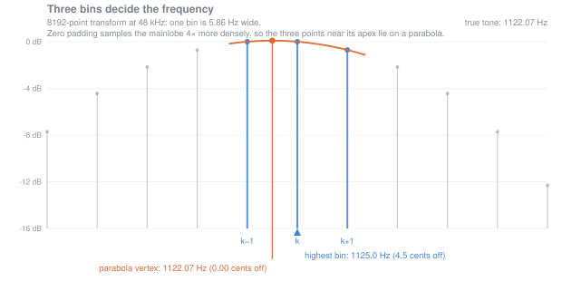
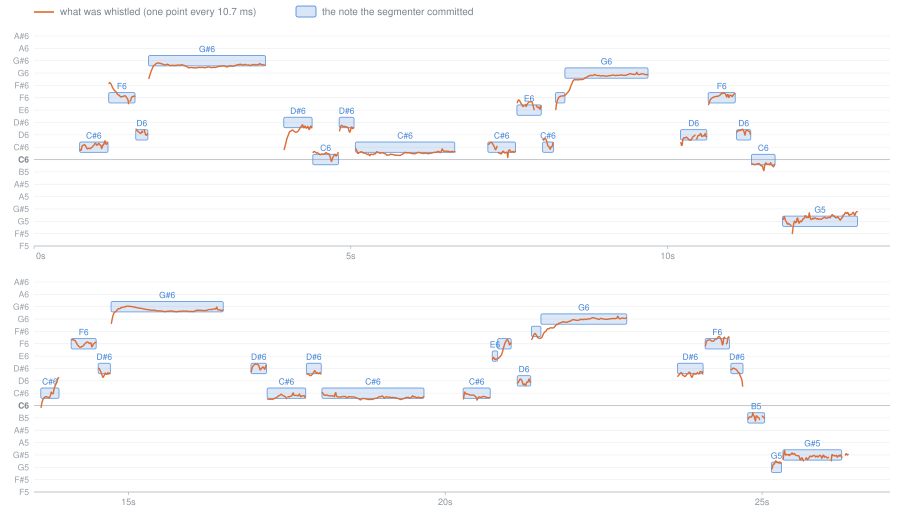
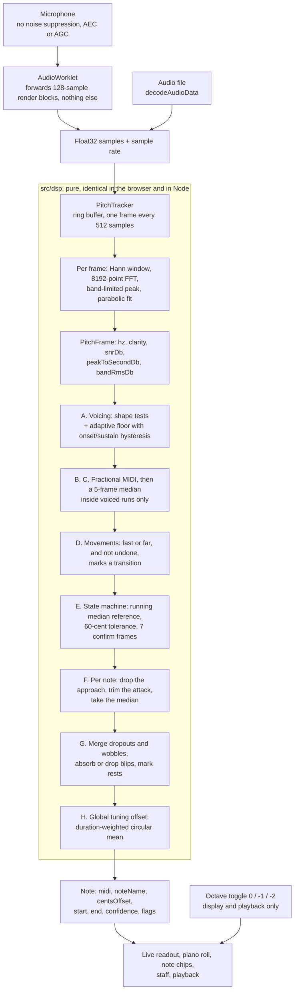

# Whistle Notes

Whistle a melody at your phone and get back the piano notes to play.

**Live: <https://lgruen.github.io/whistle-notes/>**

It is a small learning aid for beginner pianists. You hum a tune in your head
but cannot find it on the keyboard; whistling is the fastest way to get it out
of your head and onto the keys. The app listens, tracks the pitch of the
whistle, snaps it to the nearest semitones, and shows the result as note names,
a piano roll, and a rhythm-free staff you can play back to check by ear.

### Install it on your phone

It is a PWA, so there is no app store involved.

- **Android (Chrome)** — open the link, then **⋮ → Add to Home screen**.
- **iOS (Safari)** — open the link, then **Share → Add to Home Screen**.

Launched from the home screen it runs full-screen and works offline — the whole
app precaches to about 115 kB, icons included, and everything runs on the
device.

### What it deliberately does not do

- **No rhythm.** The staff shows noteheads in the order you whistled them and
  nothing else — no bars, no note values, no time signature. (The transcript
  chips mark where you paused and label each note short / medium / long relative
  to the rest of the take, but that is a hint, not notation.) Getting rhythm
  right needs beat tracking and quantisation, and none of that helps you find
  the notes under your fingers, which is the whole job.
- **One note at a time.** It follows a single pitch. Chords, two whistlers, or
  a whistle over music will confuse it.
- **No backend.** There is no server, no account and no upload. The audio is
  recorded into a buffer (capped at 60 seconds), analysed on the device, and
  replaced the next time you record. That is the privacy story and also the
  reason the app is installable and works on a plane.

---

## How it works

Four parts, in order: why a whistle is an unusually kind signal to start from,
how blocks of samples become frequencies, how the pipeline decides which of
those frequencies are real, and how the surviving trail of frequencies becomes
notes. That last step is by far the hardest — which is not the intuition most
people start with.

### 1. Why a whistle is the easiest possible input

When you whistle, your mouth is a **Helmholtz resonator** — a cavity of air
with a neck, exactly like blowing across a bottle. The tongue and lips change
the cavity's volume and the neck's size, which changes the resonant frequency.
Crucially, that resonance is a single mode: there is no string with a
fundamental and a stack of overtones, no vocal-fold buzz being filtered. The
output is very nearly a **pure sine wave**, somewhere between roughly 500 Hz
and 4 kHz.

That matters enormously for pitch detection. The hard part of transcribing a
voice or a piano is that each note arrives as a *harmonic stack* — energy at
`f`, `2f`, `3f` and so on — and the detector has to work out which of those
peaks is the fundamental. Guess wrong and you get the classic octave error,
which is the single most user-visible mistake a transcriber can make. A whistle
has essentially nothing above its fundamental, so the strongest peak in the
spectrum simply *is* the answer. (The code still runs a sub-octave sanity check
before believing it — see `subOctaveToleranceDb` in
[`src/dsp/config.ts`](src/dsp/config.ts) — but it almost never fires.)

The same physics explains something that feels like a personal failing and is
not. A comfortable whistle sits **one to two octaves above the range you would
actually play**. The reference recording used for the figure below runs from G5
to G♯6, i.e. 784–1661 Hz, when the melody obviously belongs around middle C. A
short air cavity simply resonates high; you cannot whistle a bass line. So the
pipeline reports the *true* sounding pitch, and the app has a display-only
octave toggle (0 / −1 / −2) that moves everything down to somewhere a beginner's
hands actually live. Transposition never touches the DSP — it happens at render
and playback time only.

### 2. From samples to frequencies

The microphone gives a stream of numbers: 48 000 amplitudes per second. To get
a frequency you have to look at a *block* of them at once. The pipeline takes
**2048 samples** (42.7 ms) at a time and steps forward **512 samples** between
blocks, so a new estimate lands every **10.7 ms**, or 93.75 per second, and
consecutive blocks overlap by 75%.

**Why a window function.** Cutting a 42.7 ms block out of a continuous signal is
itself a multiplication — by a rectangle. And multiplying in time is convolving
in frequency, so the spectrum of everything you look at gets smeared by the
spectrum of that rectangle, which is a `sinc` function with a first sidelobe
only 13 dB down. A quiet second tone would vanish under the skirt of a loud
one. Tapering the block to zero at both ends with a **Hann window** trades a
slightly wider main peak for sidelobes 31 dB down and falling fast, which is the
right trade here: the whistle band is nearly empty, so resolution is cheap and
dynamic range is precious. (This is "spectral leakage" in one paragraph; see
[`src/dsp/window.ts`](src/dsp/window.ts).)

The windowed block is zero-padded ×4 to 8192 points and transformed. At 48 kHz
that makes each FFT bin **5.86 Hz** wide.

**The insight worth keeping.** FFT bins are evenly spaced *in Hz*, but musical
pitch is *logarithmic* in Hz — a semitone is always a factor of 2^(1/12), which
means it is worth more Hz the higher you go. So the resolution of this method,
measured in the unit that matters musically, **improves with pitch**:

| whistle pitch | one bin is… | a semitone is… | bins per semitone |
| --- | --- | --- | --- |
| 500 Hz (≈ B4) | 20.2 cents | 29.7 Hz | 5.1 |
| 1000 Hz (≈ B5) | 10.1 cents | 59.5 Hz | 10.1 |
| 2000 Hz (≈ B6) | 5.1 cents | 118.9 Hz | 20.3 |
| 4000 Hz (≈ B7) | 2.5 cents | 237.9 Hz | 40.6 |

The method gets sharper exactly where whistles live. This is also why the
time-domain alternatives (autocorrelation, YIN, MPM) are the wrong tool for
*this* signal even though they are the right tool for voice: they find a
*period* measured in samples, and at 4 kHz a period is 12 samples long, so a
one-sample error is 144 cents — more than a semitone. Their whole advantage,
tracking a periodicity whose fundamental is missing, buys nothing when there
are no harmonics to begin with.

**Band-limiting is free noise rejection.** The peak search only looks between
**400 Hz and 4500 Hz**. Speech fundamentals (85–255 Hz), mains hum and traffic
rumble are therefore not candidates at all, however loud they are — no filter
design, no latency, just a smaller loop.

**Parabolic interpolation.** The winning bin gives the frequency only to within
half a bin. But near its apex the main lobe of a Hann window is very close to a
parabola *in decibels*, so fitting a parabola through the three log-magnitude
values at `k−1, k, k+1` and taking its vertex recovers the peak to a small
fraction of a bin. Zero padding is what makes this work well: it samples the
same main lobe four times more densely, so the three points really are near the
apex rather than straddling the whole lobe.



Swept over the whistle band on a clean synthetic tone, the nearest-bin answer is
wrong by up to 9.9 cents; after the parabola the error is under 0.05 cents.
That is not the real-world accuracy — a human whistle wobbles by far more than
that, as the next figure shows — but it does mean the *measurement* has stopped
being the limiting factor, and everything that follows is about the whistler,
not the transform.

Each frame therefore leaves this stage as a frequency plus four numbers
describing how much that frequency deserves to be believed. It contains no
thresholds at all: nothing here decides whether a frame is a note. That
separation is not just tidiness — it is what lets the offline harness compute
the expensive frames **once**, cache them, and then re-run a whole sweep of
segmentation parameters in milliseconds.

### 3. Deciding what is real

Two independent kinds of evidence, deliberately kept apart.

**Shape** — does this spectrum look like a single pure tone? Three numbers,
none of which depends on how loud anything is:

- `clarity` — the fraction of in-band energy sitting under the winning peak's
  main lobe. A pure tone concentrates nearly all of it there; breath noise
  spreads energy across the whole band.
- `snrDb` — the peak against the *median* bin. A median ignores the peak itself
  and any other tone in the room, so it measures the noise bed rather than
  "the noise bed plus whatever else is playing".
- `peakToSecondDb` — the winner against the strongest *independent* runner-up,
  with the winner's own main lobe and its 2nd and 3rd harmonics excluded (a
  harmonic of the reported pitch is evidence *for* it, not a rival).

Measured on the reference recording, the two populations sit a long way apart.
Frames inside a transcribed note have a median clarity of 0.99 and a median
peak-to-second of 26 dB; frames outside every note — breath, silence, the
scrape of a chair — sit at 0.27 and 2 dB. The thresholds (0.50, 12 dB, 6 dB)
are deliberately loose, because they only have to sit *somewhere* in a gap that
wide.

**Level** — is there more energy here than there is in this room? That question
has no fixed answer: a quiet bedroom and a café differ by more than any constant
could span. So the noise floor is estimated from the recording itself, as the
20th percentile of the nearby frames that look shapeless. Two subtleties earn
their place:

- A cough, a door or a hand over the microphone fails every tone test at 40 dB
  *above* the room, and admitting it as "background" drags the floor up to its
  level, silencing the transcription seconds later where nobody would look for
  the cause. So background evidence must be quiet as well as shapeless — which
  is circular, and the way out of the circle is to iterate: estimate, discard
  everything more than 12 dB above that estimate, re-estimate.
- The level test is **asymmetric**. Starting a note requires 12 dB over the
  floor; *holding* one requires only 6. This is hysteresis, and the asymmetry is
  the point: a note fading as the whistler runs out of breath must survive to
  its end, while a new note has to prove itself. Symmetric gating gives you
  either a stutter of fragments or a transcript full of room noise.

### 4. From frequencies to notes

Here is what a real whistle actually looks like. The thin orange line is the
frame-level pitch trail from a 27-second take; the blue rectangles are the notes
the segmenter committed to.



Nothing in that picture is flat. Notes are approached from below in audible
scoops (look at the run-up into each G♯6), they wander while held, and they
wobble. Snapping every frame to its nearest semitone and taking the most common
answer would produce a mess. Nearly all of the difficulty in this project lives
in this one figure.

**Never round early.** The first move is `midi = 69 + 12·log₂(hz / 440)`, kept
as a *fractional* number. Pitch is logarithmic in frequency, so in this domain
"how far apart are these two pitches, musically?" is plain subtraction at any
register. Rounding at this point would throw away exactly the evidence that
decides every borderline case later; the pipeline does not round until the very
last step.

**Median, not mean, everywhere.** A 5-frame median filter (≈ 53 ms) runs inside
each voiced stretch and never across a gap. A median *removes* a stray
octave-jumping frame outright; a mean would blend it in and produce a
wrong-but-plausible pitch, which is much harder to notice.

**Telling a scoop from a wobble.** This is the interesting problem. Both are a
smooth slide of a semitone or so, and no threshold on *speed* separates them: a
±60-cent vibrato at 5 Hz peaks at 18.8 semitones per second, which is faster
than a deliberate one-semitone glide taken over 120 ms. (The rate of a
sinusoidal vibrato of
±c cents at f Hz peaks at 2π·f·c/100 semitones per second — worth doing once on
paper; the number is bigger than most people guess.) And guessing wrong is
expensive in *both* directions: treat a scoop as a note and its opening frames
coin a phantom note a semitone flat; treat a vibrato as a transition and you
strip the middle out of the oscillation, leaving a bimodal pile of extremes
whose median is a coin flip between two neighbouring notes.

What does separate them is **shape**, not rate: *an oscillation comes back and a
transition does not*. So the pipeline first cuts each voiced stretch into
**movements** — stretches over which the pitch actually travels somewhere,
tracked by their running extreme so a wobble riding on top of a scoop does not
chop it into pieces. A movement counts as a transition if it is **fast**
(> 18 st/s, catching a portamento however far it goes) **or far** (> 80 cents,
catching a gentle scoop however slowly it was taken) — *and* is not immediately
undone by a comparable movement the other way. Between two real notes there is
a note in the way, several times longer than the couple of frames a wobble
spends turning around, so a genuine step is never mistaken for half a wobble.
Frames belonging to a transition still count towards the note's duration; they
just never contribute a pitch.

**Confirmation.** A running median of the last ≤ 15 accepted frames is the
note's reference pitch. A frame within 60 cents of it is the same note. A frame
outside that is *not* immediately a new note: it goes into a buffer, and a new
note is only committed after **7 mutually consistent frames** (≈ 75 ms), with
the buffer flushed back into the old note if the pitch returns. Seven is
measured, not chosen: at 3 frames a ±60-cent vibrato at 5 Hz split into twelve
notes, because a 5 Hz wobble dwells about 40 ms near each extreme and three
frames of agreement at the top of a swing look exactly like a new note. It also
cannot be raised much further — a slower, wider wobble dwells ~100 ms near each
extreme, and a confirmation long enough to out-wait *that* would swallow real
notes. So wide wobbles are additionally repaired afterwards, by reuniting two
notes whose boundary sits inside a movement that stage D recognised as an
oscillation. Measured limits: one note survives ±200 cents at 4 Hz; at ±300 it
comes apart into three.

**Attack trimming.** For notes longer than 120 ms the first 25% is dropped
before the pitch is measured. Whistlers slide *into* notes, and the slide is not
what they meant to play. (In the figure, this is why the rectangles sit at the
pitch of the plateau, not the average of plateau-plus-scoop.)

**Repeated notes.** Whether a gap between two same-pitch notes means "one held
note that the detector briefly lost" or "two notes played twice" cannot be
settled by any amount of pitch analysis — the answer is in the *level*. A
re-articulated note has a genuine drop to the noise floor between its halves; a
dropout does not. So a short gap at the same pitch merges only if no frame in it
actually fell to the background. True silence never merges, however brief.

**The tuning offset, and why the average has to be circular.** A whistler who
sits consistently 40 cents sharp gets coin-flip rounding on *every* note, so the
bias is worth measuring once and removing. But the residuals live on a circle:
they are pitch errors mod 100 cents, and +49 and −49 are *two* cents apart, not
98. Take three notes at +45, −45 and +48 cents. The arithmetic mean is +16
cents, suggesting a mild sharpness nobody has. Mapping each residual to an angle
on the circle, averaging the unit vectors and reading the answer back off the
resultant gives **+49 cents**: this whistler lands almost exactly *between* two
semitones, every time. Removing that bias moves every note off the coin-flip
boundary — including the −45 one, which is 55 cents above the semitone below and
therefore belongs to *that* note, comfortably, once the bias is gone. One
measurement, every note fixed. The length of the resultant comes free and is
exactly the test needed for whether to believe it at all: near 1 the residuals
agree and the whistler is genuinely detuned; near 0 they are scattered and the
whistler is merely unsteady, which no global offset can fix. On the take in the
figure the resultant length is 0.28, well under the 0.6 required, so no
correction was applied — which is the correct answer, and the arithmetic mean's
−8.8 cents would have been a fabricated one.

### 5. The pipeline end to end



The box around the middle of that diagram is a real boundary, enforced by a
test: everything inside `src/dsp/` must run unchanged in a browser, in Node and
in vitest — no `window`, no `AudioContext`, no `node:` imports. That is what
makes `transcribe(samples, sampleRate, cfg)` produce bit-identical output in the
app and in the offline harness, so a bad transcription on the phone can be
reproduced on a laptop and swept for a fix.

### 6. What it does badly

Honest limitations, most of them structural:

- **Monophonic only.** One pitch at a time, by construction.
- **Vibrato wider than about ±200 cents splits** into several notes. Past that
  boundary "one note with a wobble" has stopped being the better description of
  the trail, and the pipeline reports several plausible notes rather than one
  right one — the more honest of the two failures, but still a failure.
- **It is whistler-dependent.** The thresholds were set from measured
  distributions, but on one person's whistle. A breathier or quieter whistler
  will sit closer to the voicing gates.
- **Verification is thin.** The synthetic test suite covers accuracy, sample-rate
  invariance, chunk-size invariance, noise and voice interference, vibrato,
  drift, glides, scoops and repeated notes, all with ground truth true by
  construction. But there is exactly **one** real recording behind the golden
  test, and its expected note sequence is still marked as proposed rather than
  verified at a piano. Every number quoted above as "measured" comes from that
  recording plus synthetic sweeps.
- **No echo cancellation.** Recording and playback are mutually exclusive in the
  UI, because otherwise the app would happily transcribe its own playback.

---

## Practice mode

The second half of the app turns the transcriber around. Instead of *you* making
a sound and the app naming it, the app makes a sound and you answer it — with a
melody you saved, or a phrase it made up on the spot.

### Ear-first, as a rule rather than a preference

**No exercise ever shows you what to whistle.** Not a note name, not a staff, not
a "starts low" hint. The app plays; you answer; names appear afterwards, as a
report on what you actually did.

That is a constraint, not a style choice. Reading "whistle a C6" and whistling a
C6 is a *different skill* from hearing a note and matching it, and it is the
harder one for someone whose music theory is thin — a practice app that quietly
substituted it would be teaching sight-reading and calling it ear training. The
rule survives in the codebase as a narrower claim that is easy to check: **the
app names what you did, never what it wanted.** A wrong note is named, an extra
note is named; a missed note and the ghost outline behind every target are drawn
as a position and a distance. A test greps the practice markup and every
user-facing sentence for pitch names and interval words, so the rule cannot rot
into an intention.

### Telling five kinds of wrong apart

Scoring an echo looks trivial and is not. Nobody echoes a phrase in the register
it played in — a beginner reproduces the *shape*, wherever their mouth is
comfortable — so comparing absolute pitches would mark a perfect attempt
completely wrong. And one dropped note shifts every later note by a slot, so
comparing position by position would report ten failures where there was one.

So the attempt is aligned against the target with Needleman–Wunsch, once per
candidate transposition, keeping the shift that fits best. Three constants decide
everything, and their *relationships* matter far more than their values:

| cost | value | what it buys |
|---|---|---|
| gap | 1 | a target note left unsung, or a note that answers to nothing |
| substitution | 0 → 1.5 | zero within 30 cents, rising, flat past a whole tone |
| register | ≤ 0.25 | per pairing, for moving off the register that played |
| duration | ≤ 0.02 | a tie-break, never a verdict |

**`substitution_max < 2 × gap` is the anti-cascade guarantee.** Pairing two notes
always costs less than throwing both away, *whatever* they are — an octave apart,
a tritone apart, anything. So the aligner can never answer "you missed a note and
added one" where the honest answer is "you sang one wrong note". That failure is
the one that makes a diff useless, because it turns one mistake into two and
pushes the error's location off by a slot. It is a theorem here rather than a
hope, and the test suite sweeps it directly. Both tie-breakers are bounded to
keep it: substitution + register + duration is 1.77, still under two gaps.

The register cost is the interesting one, because without it the search is
*symmetric* and symmetry is wrong here. The app chose the pitch it played the
melody at, so "the register it played in" is the null hypothesis and every other
one is a claim that you moved. Whistle six notes and crack the first three an
octave: three notes are wrong at the played register, the *other* three are wrong
an octave down, the two cost exactly the same, and the tie went to whichever the
sweep happened to reach first — so half the time the verdicts came back inverted,
with the notes you got right marked as the wrong ones. A small surcharge per
paired note settles it, and being per note is what keeps it a tie-breaker rather
than a wall: a whole melody genuinely echoed an octave up still wins its register
six to one, while a bare majority of cracked notes does not.

Rhythm never fails a note. Duration enters only as a tie-break worth two
hundredths of a gap, with both sides put on **one** tempo — the level in
log-duration space — so a slow echo of a fast phrase costs nothing. (Normalising
each side by its own median, which is the obvious thing, puts the same physical
note at two different numbers the moment one is missing, and then names the wrong
slot in about a quarter of the drops it exists to explain.) The only thing rhythm
decides is genuinely undecidable on pitch alone: which of three identical
repeated notes was the one you dropped.

What comes out is a verdict per slot:

- **clean** — within 30 cents. The note, wobble and all.
- **off** — 30 to 70 cents. Recognisably the right note, missed by your mouth.
- **wrong** — 70 cents or more. A different note came out, and the app names it.
- **missing** — never sung.
- **extra** — sung, and answering to nothing in the melody.

### Three problems that all look like "wrong notes"

The reason those five categories are worth the trouble is that a beginner's
mistakes have at least three different causes, and they want completely different
practice:

- **Production.** You know the note and your mouth misses it. Shows up as `off`
  verdicts and as a wide, wandering pitch trail.
- **Memory.** You do not have the melody. Shows up as `missing` slots, or as the
  same slot going wrong attempt after attempt.
- **Interval knowledge.** You know the tune but not how far the next jump is.
  Shows up as `wrong` verdicts clustered on particular *steps* rather than on
  particular positions.

So the history is aggregated along two different axes. Per slot of one melody
("bar three has beaten me nine times out of ten") and per **directed interval** —
keyed by the signed semitone step, because a rising minor 3rd and a falling one
are genuinely different skills. Both keep production and wrong-notes apart: the
cents average only ever averages slots that came out as the *right* note, since a
wrong note's residual can be 1200 cents and is not a fact about aim at all.

And the exercises line up with the causes. **Hold a note** is production with
memory and intervals removed — one reference tone, held back, scored as three
numbers that fail in different directions: where the middle of it sat, how wide
it wandered, and how far it *travelled* end to end. The third is not a nicety.
The first two are both positional, and a note that sinks a whole semitone over
two seconds has its median halfway down the slide and an interquartile range of
half the excursion — so the drill called a hundred-cent failure "±19 cents,
steady and close", under-stating it four times over and offering advice for the
wrong problem, since a slide wants more air behind it and a wobble wants less.
**Echo a phrase** is interval knowledge with memory removed — the phrase is
generated, so there is nothing to have practised. **Melody recall** is all three
at once, which is why it needs the diff.

### Drills that follow the weakness

Each attempt folds into an EWMA per directed interval — a short one, half-life
about two and a half observations, because the question is "is this a problem
*today*". A weakness score combines the two failure modes at their natural
scales: the wrong-note rate, plus at most half a point of aim error measured in
units of the 70 cents where off-pitch stops being off-pitch.

The phrase generator turns that into a **bias, not a filter**. Every step from a
semitone to an octave keeps a base weight (small steps common, leaps rare), and a
weak interval's weight is multiplied up. Three reasons it is a multiplier rather
than a whitelist: with no history every multiplier is 1 and the generator *is* a
plain random walk, so the cold-start fallback is not a second code path; a drill
that only played your three worst intervals would stop being an ear test; and
over-sampling an interval is what *changes* its average, so the bias has to be
gentle enough for the statistic to climb back out. Phrases ramp from three notes
to six as you get them.

A weight is not a frequency, though, and that gap is where the drill quietly
failed at the thing it was built for. The walk drops the steps that would leave
your register and re-normalises what is left, so a step's share of the phrases
actually drawn is its weight times the fraction of notes it is *legal* from — and
a ninth is legal from four of the thirteen notes in a default register against
eleven for a whole tone. The multiplier alone therefore kept about a third of its
bias: a maximally weak 6th reached 4.8% of drawn steps where an ordinary step
gets around 10%. Dividing the gain by that availability is the cancellation, and
takes it to 11.6% — which is what "as often as an ordinary step" was always meant
to mean, and it is the whole reason the third tier of leaps exists.

### Two ways of being 40 cents sharp

One detail worth knowing, because getting it wrong is invisible. The transcriber
measures each take's global tuning bias and takes it out before rounding to note
names — which is what rescues a consistently-sharp whistler from coin-flip note
names, and is *exactly* the bias practice mode is trying to report. So both
exercises are handed the **raw** pitch, with that correction put back on, and
they do different things with it:

- **The hold drill** reports it as it stands. That is its whole question: one
  note, absolute aim, "you held it 45 cents sharp". Feed it a corrected trail and
  a whistler who sits 40 cents sharp on every note is told they are perfect, by a
  machine that quietly moved the target to meet them.
- **Recall and the echo drill** estimate it and then score the *shape* around it,
  because 45 cents sharp on every note of a melody is one fact about a whistle
  rather than five wrong notes — and the screen says which reference it used, in
  the same words the hold drill uses for the same number.

The estimate has no threshold in it anywhere, and that is deliberate: the
transcriber's own correction switches off below a concentration gate, and when
recall inherited that gate it inherited a *cliff*. The same whistler with ten
cents more jitter went from seven clean notes to two clean, five off and one
wrong. Here each note's contribution is weighted by a taper that falls to zero at
the boundary where a note stops being that note, so a wrong note weighs nothing
rather than dragging the reference towards itself, and a note drifting across the
line changes the answer by nothing at all.

### Whistling along

There is also a warm-up: the melody scrolls past on a roll, the synth plays it,
and your own pitch is drawn over the top in real time. Nothing is scored and
nothing is stored, and that is what makes it possible at all — it is the one
place the app opens the microphone and the speaker together. Everywhere else that
is forbidden, because echo cancellation is switched off on purpose (speech AEC
eats a sustained whistle) and the phone would otherwise transcribe its own
playback. Here the microphone's output goes nowhere but a line on a canvas, so
the worst the echo can do is trace the melody faintly under you. The screen says
so, and suggests headphones.

---

## Development

```sh
npm ci
npm run dev        # http://localhost:5173
npm test           # vitest run
npm run build      # tsc --noEmit && vite build
npm run preview    # serve dist/ — the only way to exercise the service worker
```

### Tuning against a real recording, without a browser

The offline harness runs the *same* `transcribe()` the app calls, so anything
seen here reproduces on the phone and vice versa:

```sh
npx tsx tools/transcribe-file.ts take.wav              # note table + one-line sequence
npx tsx tools/transcribe-file.ts take.wav --plot       # ASCII pitch trail: the go/no-go eyeball test
npx tsx tools/transcribe-file.ts take.wav --histogram  # metric distributions, voiced vs not
```

Because the pitch stage is threshold-free, the expensive part can be computed
once and every threshold swept against it in milliseconds:

```sh
npx tsx tools/transcribe-file.ts take.wav --frames-cache frames.json
npx tsx tools/transcribe-file.ts --from-cache frames.json \
  --sweep segment.toleranceCents=40,60,80 --sweep segment.confirmFrames=5,7,9
```

Each combination prints its own note sequence, so *stability* — the transcript
not changing across neighbouring settings — is visible directly, which is the
only defence against fitting a constant to one recording. `--set k.k=v` pins a
single value, `--preset strict|normal|forgiving` picks a wobble-tolerance
preset, and `--json` / `--frames out.csv` dump everything for another tool.
Sweeping an `analysis.*` key re-runs the FFT stage and says so, because those
settings *produce* the frames rather than interpret them.

The figures in this README are generated from that output and committed as SVG;
the audio never is:

```sh
npx tsx tools/transcribe-file.ts take.wav --frames f.csv
npx tsx tools/transcribe-file.ts take.wav --json > t.json
npx tsx tools/plot-frames.ts trail --frames f.csv --notes t.json --out docs/trail.svg
npx tsx tools/plot-frames.ts parabola --out docs/parabolic-interpolation.svg
```

### On an Android phone

Plain `http://localhost` counts as a secure context, so the microphone works
without certificates. Connect the phone over USB, open `chrome://inspect` on the
desktop, use **Port forwarding** to map `localhost:5173` to the dev server, then
load `http://localhost:5173` on the phone. That gives hot reload, microphone
access and full remote DevTools with no mkcert, no tunnel and no self-signed
certificate. The **Debug** panel in the app reports what the browser actually
granted — sample rate, and whether noise suppression, echo cancellation and gain
control really are off — which is the one thing a laptop cannot tell you.

### Deploy

Pushing to `main` runs the CI workflow: typecheck, tests and a production build
gate a GitHub Pages deploy. The footer shows a short build stamp taken from the
commit SHA, so "is the browser running what I just pushed, or a cached service
worker?" is a one-glance question.

[CLAUDE.md](CLAUDE.md) has the repository layout, the invariants and the
maintenance notes.

## Credits

Built with [Vite](https://vite.dev/) and
[vite-plugin-pwa](https://vite-pwa-org.netlify.app/). The only runtime
dependency is [`fft.js`](https://github.com/indutny/fft.js) — everything else,
including the staff renderer and the piano roll, is hand-rolled.

## License

[MIT](LICENSE)
